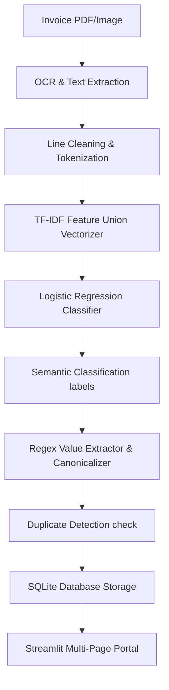

# Smart Invoice Automation System - Enterprise AP Portal

An advanced, end-to-end Machine Learning and OCR-driven Accounts Payable (AP) automation platform. This system utilizes digitized text layers, character-level TF-IDF feature unions, and an optimized Logistic Regression classifier to achieve **98.00% semantic classification accuracy** for extracting invoice fields.

---

## 🚀 Key Features

1. **AP Dashboard**: Real-time business metrics dynamically populated from SQLite showing Total Processed, Verified, Pending Review, Duplicate alerts, average OCR reliability, and cumulative transaction volume over time.
2. **Upload Invoice**: Drag-and-drop ingestion interface supporting PDF, PNG, and JPEG formats, coupled with ML sensitivity controls.
3. **Extraction Result**: Structured tabular fields breakdown immediately after processing showing value-level prediction confidence and Accepted/Review status indicators.
4. **Human-in-the-Loop (HITL) Verification**: Side-by-side verification interface linking PyMuPDF-rendered document page views on the left column, and editable form review inputs on the right column. Includes actions to Reset fields, Verify, and export individual CSV/JSON files.
5. **Model Performance**: Evaluation suite for professors displaying Accuracy/F1 metrics, interactive Plotly Confusion Matrix heatmaps, label distributions, and test set prediction comparisons.
6. **Export Ledger**: Searchable historical database ledger supporting downloads for auditing (CSV) and developer syncing (JSON).

---

## 🛠️ Tech Stack & Architecture

- **Core UI**: Python, Streamlit
- **Visualization**: Plotly Express (Interactive Combo Charts, Gauges, Heatmaps)
- **Database**: SQLite3 (Local persistence layer)
- **Model Classifier**: Scikit-Learn (TF-IDF Vectorizers + Logistic Regression Classifier)
- **OCR Engine**: PyMuPDF (`fitz`), PIL (In-memory page-to-image previewers)



---

## 📊 Model Classification Performance

The trained classifier separates lines into 8 semantic classes: `VENDOR_NAME`, `INVOICE_ID`, `INVOICE_DATE`, `DUE_DATE`, `TOTAL_AMOUNT`, `TAX_AMOUNT`, `GSTIN`, and `OTHER`.

| Metric | Score |
|---|---|
| **Overall Accuracy** | 98.0% |
| **Precision** | 0.98 |
| **Recall** | 0.98 |
| **F1-Score** | 0.98 |

---

## 🗄️ SQLite Database Schema

The database table `invoices` persists all records and processing runs:

| Field | Type | Description |
|---|---|---|
| `id` | INTEGER | Primary Key (autoincrement) |
| `file_name` | TEXT | Uploaded filename |
| `invoice_id` | TEXT | Extracted unique invoice ID |
| `vendor_name` | TEXT | Canonicalized vendor name |
| `canonical_vendor_id`| TEXT | System ID mapped to vendor master catalog |
| `invoice_date` | TEXT | Extraction date (ISO format) |
| `due_date` | TEXT | Extraction due date (ISO format) |
| `total_amount` | REAL | Total invoice value (INR) |
| `tax_amount` | REAL | Extracted tax value |
| `currency` | TEXT | Currency indicator (default `INR`) |
| `gstin` | TEXT | Extracted Tax/GST ID |
| `status` | TEXT | Audit status (`Verified`, `Pending Review`) |
| `duplicate_flag` | INTEGER| Binary duplicate warning alert indicator |
| `average_confidence` | REAL | Aggregate confidence across fields |
| `field_metadata_json`| TEXT | JSON dictionary storing field-level prediction metrics |
| `created_at` | TEXT | System ingestion timestamp |

---

## ⚡ Setup & Run

### 1. Configure Python Environment
Ensure Python 3.10+ is installed:
```powershell
python -m venv .venv
.venv\Scripts\activate
pip install -r requirements.txt
```

### 2. Run Database and E2E Tests
Validate the ML classification model, database orchestrators, and value parsing rules before launching the app:
```powershell
# Test E2E parsing pipeline
python src/test_pipeline.py

# Test Database CRUD and duplicate validation
python src/test_database.py
```

### 3. Launch Streamlit Application
Start the server and access it in your local browser at `http://localhost:8501`:
```powershell
streamlit run app.py
```

*Note: On first startup, the database automatically seeds exactly 25 realistic invoices (including programmatically parsed sample PDFs from the test pack) to show a rich dashboard overview.*
