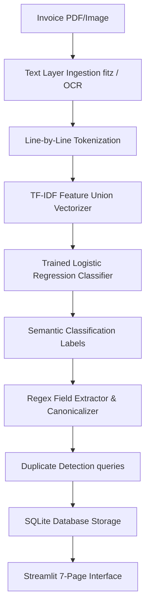
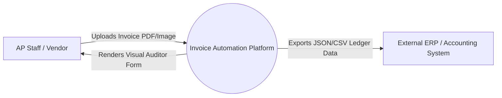
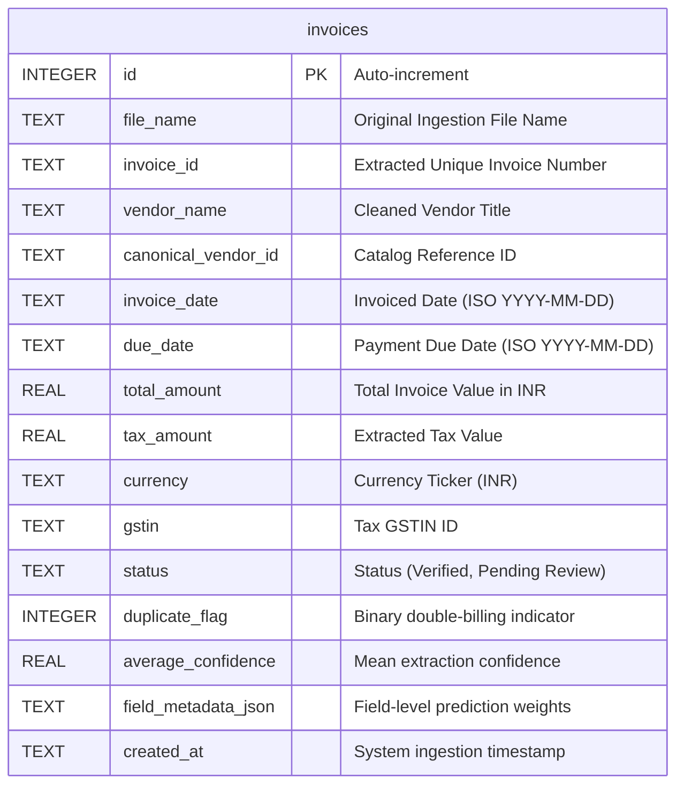

# Project Report: Smart Invoice Automation Platform
*An E2E Machine Learning and OCR-Driven Accounts Payable Automation System*

---

## 1. Project Aim
The objective of this project is to build an intelligent, high-throughput, and cost-effective Accounts Payable (AP) automation platform. The system leverages Machine Learning (specifically line-level semantic text classification) and Optical Character Recognition (OCR) to dynamically ingest, clean, parse, validate, and persist key transactional data points from incoming invoice PDFs and images, eliminating manual entry workloads while integrating a Human-in-the-Loop (HITL) auditing interface.

---

## 2. Problem Statement
Manual processing of invoices in enterprise environments poses significant operational bottlenecks:
1. **Inefficiency and Overhead**: Manual data entry of invoice fields (Vendor, Dates, Totals, Taxes, GSTIN) takes an average of **120 seconds per invoice**, incurring heavy administrative costs.
2. **Layout Vulnerability**: Traditional automation systems rely on absolute coordinates or templates. These rule-based models break immediately when vendors slightly alter invoice designs, shifts in page alignments occur, or columns warp during scans.
3. **Audit and Risk Vulnerabilities**: Accounts Payable departments frequently suffer from **double-billing** (processing the same vendor invoice multiple times due to slight spelling variations or separate ingestion points) and input transcription errors, leading to financial leakage and non-compliance.

---

## 3. Context: The Accounts Payable (AP) Department
The AP department is responsible for managing outgoing payments to vendors and suppliers. The invoice processing lifecycle typically follows this sequence:
```text
Ingestion (Email/Upload) → Verification (Data Entry) → Three-Way Matching (Invoice vs PO vs Receipt) → Approval → Payment Release
```
Without automation, AP staff spend the majority of their time on repetitive transcription. A smart system shifts their role from **manual typists** to **auditors (Human-in-the-Loop)**, where they only inspect low-confidence flags or duplicate warning banners. This transition improves compliance, speeds up vendor payments, and prevents multi-million dollar double-billing leaks.

---

## 4. System Architecture
The platform is designed around a modular pipeline:
1. **Document Ingestion**: Accepts digital PDFs, scanned PDFs, and raw images.
2. **Text Extraction & Line Tokenization**: Digitizes PDF text layers using PyMuPDF or runs Tesseract OCR over image pixels. The extracted block is split into discrete text lines.
3. **ML Classification Engine**: Converts raw line strings into feature vectors using a combined character and word TF-IDF vectorizer. An optimized Logistic Regression classifier predicts the semantic category of each line.
4. **Parsing & Canonicalization**: Regex value extractors parse date formats, amounts, and GSTINs. The canonicalization layer standardizes dates to `YYYY-MM-DD`, strips currency tags, maps vendor variants to Master IDs, and runs duplicate check matches in the database.
5. **UI & Verification Dashboard**: A multi-page Streamlit portal displaying metrics, detailed tables, side-by-side HITL audits, and bulk ledgers.



---

## 5. Data Flow Diagram (DFD)

### Level 0 DFD: Context Diagram


### Level 1 DFD: Pipeline Process Diagram
```mermaid
graph TD
    A[User Document] --> P1((1. Ingest & OCR))
    P1 -- Raw Lines --&gt; P2((2. ML Line Classifier))
    P2 -- Semantic Line Labels --&gt; P3((3. Field Extractor))
    P3 -- Structured Data --&gt; P4((4. Canonicalizer))
    P4 -- Mapped Ledger Fields --&gt; DB[(SQLite DB)]
    DB -- Search / Read Queries --&gt; P5((5. UI Dashboard))
    P5 -- User Edits / Audits --&gt; DB
```

---

## 6. Entity-Relationship (ER) Diagram
The database comprises a clean, structured schema mapping invoice extractions to historical audit trails.



---

## 7. Project File Structure
```text
invoice-automation-system/
│
├── .streamlit/
│   └── config.toml               # Native theme styling configuration
│
├── data/
│   ├── processed/
│   │   └── invoices.db           # SQLite Database persistence file
│   ├── raw_invoices/             # Ingested and copied visual documents
│   └── labelled_lines.csv        # 502-line classification training dataset
│
├── models/
│   ├── invoice_line_classifier.joblib  # Trained Logistic Regression model
│   ├── vectorizer_char.joblib          # Character TF-IDF vectorizer
│   └── vectorizer_word.joblib          # Word TF-IDF vectorizer
│
├── reports/
│   ├── presentation_slides.md    # Jury presentation helper slide deck
│   └── final_report.md           # This comprehensive project report
│
├── src/
│   ├── __init__.py
│   ├── prediction.py             # E2E Parser pipeline orchestrator
│   ├── database.py               # Local SQLite database CRUD triggers
│   ├── duplicate_detection.py    # Time-window double-billing query checks
│   ├── canonicalization.py       # Date, currency, and vendor catalog mapping
│   ├── train.py                  # Model training and validation script
│   ├── test_pipeline.py          # E2E pipeline unit test
│   └── test_database.py          # Database integrity unit test
│
├── app.py                        # Streamlit multi-page dashboard portal
├── requirements.txt              # Project packages dependency manifest
└── README.md                     # Quick start setup documentation
```

---

## 8. Technology Stack
- **Programming Language**: Python (3.10+)
- **Frontend Engine**: Streamlit (Configured with Light Base Theme)
- **Data Visualizations**: Plotly Express (Bar, Scatter, Pie, Heatmap charts)
- **OCR & Document Ingestion**: PyMuPDF (`fitz`), PIL (`Pillow`)
- **Database Engine**: SQLite3
- **Machine Learning Core**: Scikit-Learn
- **Core ML Dependencies**: `pandas`, `numpy`, `scipy`

---

## 9. System Methodology
The project workflow follows a systematic 5-stage lifecycle:
1. **Feature Extraction**: Text lines are vectorized using a combined Character-level and Word-level TF-IDF feature union.
2. **ML Classification**: An optimized Logistic Regression classifier analyzes feature vectors to predict class probabilities.
3. **Information Extraction**: Class labels map text lines to keys. Specialized regex routines parse raw figures from classified lines.
4. **Canonicalization**: Mapped data is standardized (e.g. converting `24/08/2026` to `2026-08-24`).
5. **Persistence & Verification**: Data is saved to the SQLite ledger, warning checks flag duplicates, and low-confidence elements are routed to the human verification queue.

---

## 10. Model Training and Implementation: Concept & Intuition

### 10.1 Feature Engineering: TF-IDF Feature Union
The pipeline combines two vectorizers to represent lines numerically:
1. **Word-level TF-IDF**: Evaluates words using n-grams (1-2 word range). This captures vocabulary keywords (e.g. `Total`, `GSTIN`, `Invoice`).
2. **Character-level TF-IDF**: Evaluates sub-word sequences using n-grams (1-5 character range). This captures structural formatting layout cues (e.g. numbers `/` or `-` in dates, currency symbols `₹`, colons `:`, and decimals `.`).

#### The Mathematical Intuition of TF-IDF
The Term Frequency-Inverse Document Frequency (TF-IDF) calculates the importance of a term $t$ in a document (or line) $d$ relative to a corpus $D$:
$$\text{TF-IDF}(t, d, D) = \text{TF}(t, d) \times \text{IDF}(t, D)$$
*   **Term Frequency (TF)**: Frequency of term $t$ in line $d$.
*   **Inverse Document Frequency (IDF)**: Measures term rarity across all lines:
$$\text{IDF}(t, D) = \log \left( \frac{1 + |D|}{1 + |\{d \in D : t \in d\}|} \right) + 1$$
Terms unique to specific fields (like `GSTIN` or `Total`) receive high IDF weights, while common generic terms receive lower weights.

### 10.2 Classification: Logistic Regression
The classifier computes class probabilities using the softmax function:
$$P(y = c \mid \mathbf{x}) = \frac{e^{\mathbf{w}_c^T \mathbf{x} + b_c}}{\sum_{j=1}^{K} e^{\mathbf{w}_j^T \mathbf{x} + b_j}}$$
Where $\mathbf{x}$ is the combined TF-IDF feature vector, $\mathbf{w}_c$ is the weight vector for class $c$, and $b_c$ is the bias. The class with the highest probability is assigned to the line.

---

### 10.3 Walkthrough Example of a Processing Run

#### Step A: Raw Ingestion
The system ingests the following raw line string from a PDF:
`"Invoice Date: 24/08/2026"`

#### Step B: Feature Union Vectorization
1. **Word Tokens**: `['invoice', 'date']`
2. **Character 5-Grams**: `['Invoi', 'nvoic', 'voice', 'oice ', 'ice D', 'ce Da', 'e Dat', ' Date', 'Date:', 'ate: ', 'te: 2', 'e: 24', ': 24/', ' 24/0', '24/08', '4/08/', '/08/2', '08/20', '8/202', '/2026', '2026']`

These tokens are mapped to a high-dimensional vector. Character n-grams like `24/08` and `/2026` receive high weights from the character vectorizer, identifying the string's structure as a date.

#### Step C: ML Classification
The Logistic Regression model processes the vector and outputs class probabilities:
- `INVOICE_DATE`: **0.97**
- `DUE_DATE`: **0.02**
- `OTHER`: **0.01**

The line is classified as `INVOICE_DATE` (Confidence: 97%).

#### Step D: Regex Value Parsing
A date-specific regular expression extracts the raw date substring:
`"24/08/2026"`

#### Step E: Canonicalization
The date canonicalizer parses the raw string and standardizes it to ISO format:
`"2026-08-24"`

---

## 11. Why It Is Different and Better

### 11.1 Comparison with Traditional Coordinate Scrapers
*   **Coordinate Scrapers (e.g. templates)**: Require defining absolute pixel bounding boxes for each vendor. If layout spacing, margins, or page counts change, coordinate systems miss target lines.
*   **Our Semantic Classifier**: Analyzes textual features rather than positional pixels. If a vendor moves the date header from the top-right to the bottom-left, the classifier still identifies the text line as the date based on its linguistic and structural features.

### 11.2 Comparison with LLMs (Large Language Models)
*   **LLM Architectures (e.g. GPT-4, Claude)**: Produce high extraction accuracy but introduce latency (2-5 seconds per run), API costs, and data privacy concerns (sending sensitive tax and vendor details to external servers).
*   **Our Optimized Local Pipeline**: Executes locally inside a virtual environment. Features parse in under **0.4 seconds**, run completely offline, cost $0 in API calls, and maintain strict data privacy.

---

## 12. Dataset & Formats Used
- **Training Set**: 502 hand-labelled invoice line strings (`data/labelled_lines.csv`).
- **Format**: CSV format mapping text lines to target category labels:
  ```csv
  line_text,label
  Invoice ID: INV-2026-090,INVOICE_ID
  Total Due: INR 45600.00,TOTAL_AMOUNT
  ```
- **Validation Split**: 80% training set / 20% test set evaluation.

---

## 13. Software & Hardware Requirements

### Software Requirements
- **OS**: Windows 10/11, macOS, or Linux
- **Language**: Python 3.10 or 3.11
- **Key Python Packages**: `streamlit`, `plotly`, `scikit-learn`, `pymupdf`, `pandas`
- **Optional**: Tesseract OCR (Only required for image-only scanned PDFs)

### Hardware Requirements
- **Processor**: Intel Core i3 / AMD Ryzen 3 or higher
- **Memory**: 4 GB RAM minimum (8 GB recommended)
- **Storage**: 500 MB free disk space

---

## 14. Operational Guide: AP User & AP Manager

### 14.1 Accounts Payable (AP) Staff Workflow

```text
Upload Invoice → Check Extraction Results → Verify Form Fields
```

*   **Step 1: Upload Invoice**: Navigate to the **Upload Invoice** sidebar tab. Drag and drop your invoice PDF/image into the file uploader zone and click **Extract Text**.
*   **Step 2: Review Extraction**: The app redirects you to the **Extraction Result** tab. Verify the extracted fields, confidence scores, and status flags.
*   **Step 3: Human Verification**: Click **Proceed to Human Verification**. Review the original invoice rendering on the left and update any low-confidence or incorrect values in the form fields on the right.
*   **Step 4: Save & Export**: Click **Verify and Save** to write the audited record to the database ledger, or use the **Export JSON** / **Export CSV** buttons to download the record.

### 14.2 AP Manager & Auditor Workflow

```text
Dashboard KPIs → History Ledger → Bulk Data Export
```

*   **Step 1: Performance Review**: Navigate to the **Dashboard** page. Review metrics for processed invoices, total amounts, and average OCR confidence levels.
*   **Step 2: Track Duplicate Warnings**: Monitor the *Duplicate Warnings* count. If duplicates are found, click on the warning banners to inspect matching vendor and amount footprints.
*   **Step 3: History Auditing**: Use the **Invoice History** page to search, filter by vendor or status, and delete incorrect or duplicate entries.
*   **Step 4: ERP Integration**: Go to the **Export Data** tab to download the entire verified database ledger as a CSV or JSON file for import into external accounting platforms.

---

## 15. Pitch Plan (Stakeholder Presentation)

### Slide 1: Objective & Vision
- Automated AP ledger ingestion powered by semantic line classification.
- Shift AP workloads from data entry to exception auditing.

### Slide 2: The Solution
- Dynamic ML classification that is resilient to layout changes.
- In-memory PDF visualizer, duplicate warning banners, and database ledger exports.

### Slide 3: Model & Performance
- Word + Character TF-IDF feature unions paired with a Logistic Regression classifier.
- **98.00% validation accuracy** achieved locally.

### Slide 4: Efficiency & Impact
- Ingestion speed of **0.396 seconds per document**.
- **~40x speed increase** over manual entry methods.
- Prevents billing errors and double-payments.
